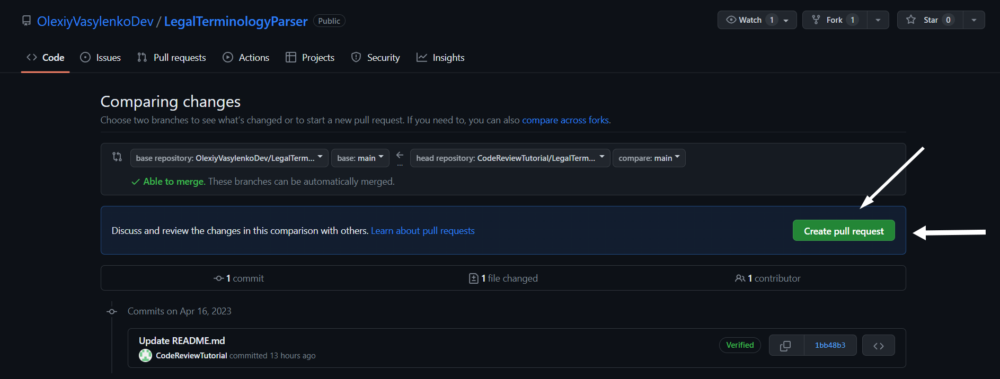
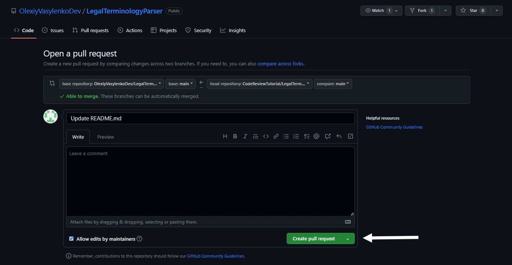
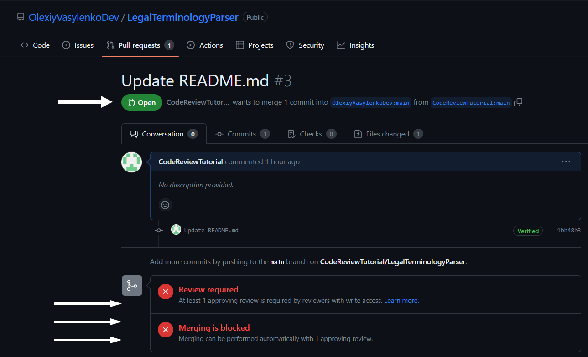
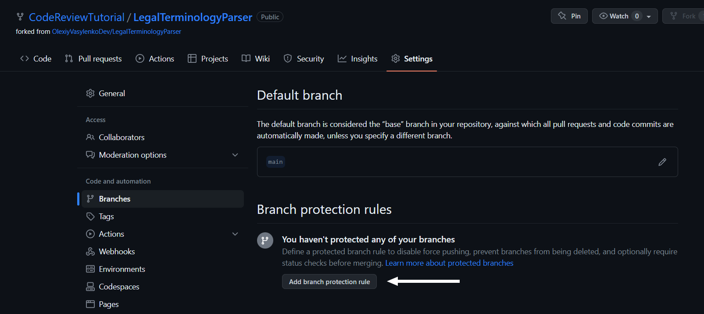
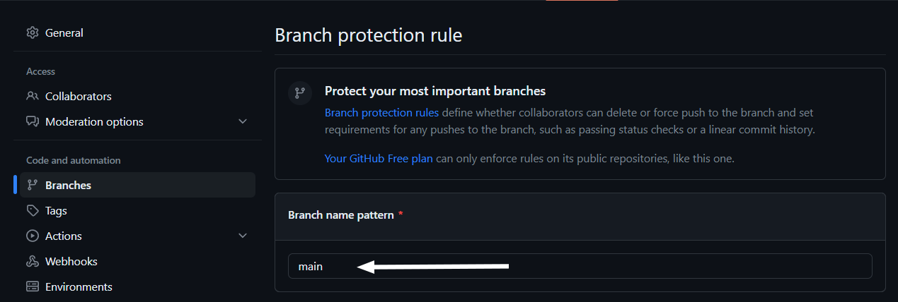
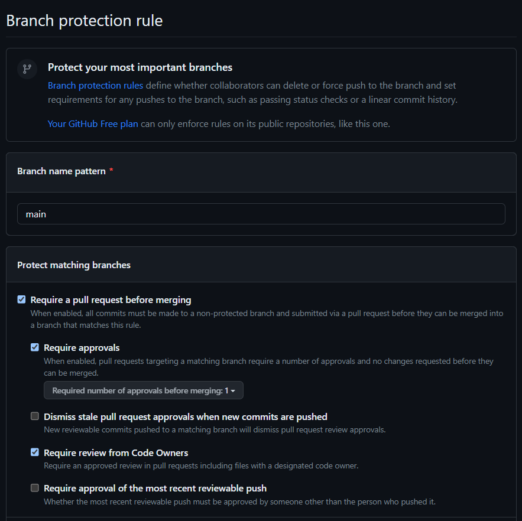

# Code review of a GitHub repository. Tutorial

### Table of contents

* [Code Review](#code-review)
* [Branch Protection](#branch-protection)

## Code Review

1. First, go to the repository and find the "Fork" button, as highlighted by the arrows in the screenshot below:

2. Click on the "Fork" button, and you should see the following screen. You can choose your own name for the forked repository, or keep it the same as the original. You can also add a description if you like. After filling the fields, click on the "Create fork" button.

3. After some time, your forked repository will be created and displayed among your repositories.

4. Next, copy the web URL of the newly-forked repository and go to your terminal. Type `git clone <copied URL>` to clone the repository to your local machine. In my case, the command looks like this: `git clone https://github.com/CodeReviewTutorial/LegalTerminologyParser.git`

5. Once you have cloned the repository to your local machine, you can open it in your code editor and dive deep into reviewing and refactoring the project.

6. When you are finished with the code review, commit and push your changes to the remote repository. You can do this by running `git commit -m '<commit message>'` and `git push origin <remote branch name>`, or by using your code editor's git UI.

7. After you have pushed the reviewed project to your repository, you are almost to the finish line. The last thing you need to do is to create a pull request. Click on 'Pull requests' -> 'New pull request'.

8. You can review the changes made in the 'Files changed' tab to ensure everything looks good. After that you need to click on "Create pull request" as highlighted by the arrow.

9. Once you have reviewed and filled in the necessary information such as the name of pull request and description, click on the 'Create pull request' button again to submit your pull request for review by the repository owner or collaborators.

10. And that's it. If you have done everything correct, there should be a green button "Open", which you can see on the screenshot. You DON'T NEED TO MERGE or to do anything else after this.

## Branch Protection

1. As you can see at the bottom of my previous screenshot, I cannot merge my pull request directly to the original repo. This is due to protection rules, which you can set in your branches' settings. Let me show you how. First, you need to go to your repository settings and select "Branches".

2. Next, you should click on "Add branch protection rules".

3. And the last point is to actually configure the rules. First, you need to set the branch to be protected. In my case, there is only one branch "main", but you can either protect your branch or to create a specific branch for this code review. Remember that the protection rules should be set for every branch independently.

4. Finally, you need to scroll down till "Protect matching branch" section and check the boxes as shown on the screenshot. It will be enough to protect the branch from unexpected consequences during code review.

5. And that's it! Now you know how to do code review of a full GitHub repository and how to prepare your own repo for the review. 

